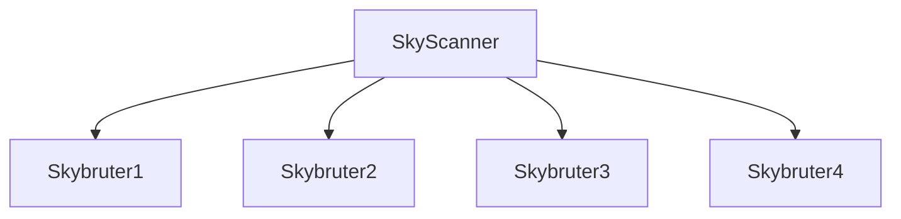

# SkyIsYours
A Scanner and Bruter armed with arts of work distribution

## Features
```
smart scanning
fast brute force speed (17 ssh brute per second)
fast scanning speed
load distribution
fault tolerant sockets
interprocess mode
```

## The Sky architecture


## SkyBruter

```mermard
graph TD
    subgraph Golang Program
        A[Main Routine] -->|Spawns Pool| B[Worker Pool]
        B -->|1| C[Goroutine 1]
        B -->|2| D[Goroutine 2]
        B -->|3| E[Goroutine 3]
        B -->|...| F[Goroutine ...]
        B -->|100| G[Goroutine 100]
    end

    subgraph Server
        H[Server]
        C -->|Connects to| H
        D -->|Connects to| H
        E -->|Connects to| H
        F -->|Connects to| H
        G -->|Connects to| H
    end
```
## BENCHMARK

system information
```
CPU: 12th Gen Intel i7-12700H (20) @ 2.688GHz
Cores: 14
OS: Arch
arch: Amd64
RAM: 16gb
bandwidth: 100mbps
```


### Benchmark 1000 pass dictionary attack


