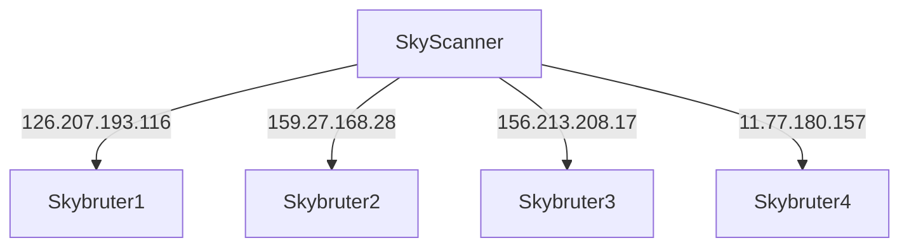
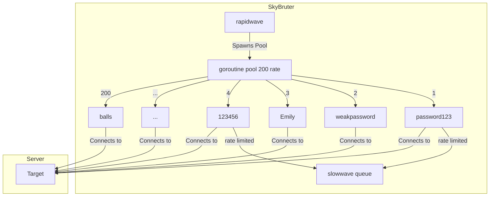
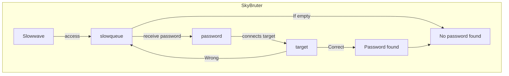

# SkyIsYours
A Scanner and Bruter armed with arts of work distribution

## Features
```
smart scanning
fast brute force speed (17-21 ssh brute per second)
fast scanning speed
load distribution
fault tolerant sockets
interprocess mode
SSH
```

## The Sky architecture
### Load balancing


## SkyBruter
### rapid wave

Skybruter initiates a rapidwave by spawning a limited pool of up to 200 goroutines, each attempting to connect to the server with distinct passwords. In case of ratelimiting, the goroutine joins a slowwave queue. If the result indicates an invalid password or ratelimiting, the goroutine relinquishes its position, allowing other goroutines with different passwords to join. Upon discovering the correct password, no new goroutines are allowed, and slowwave is canceled. If unsuccessful, slowwave validates ratelimited passwords.



### slowwave
Slowwave is designed to validate passwords obtained from a ratelimited source by employing a traditional SSH brute-force approach. It systematically attempts each password one by one, determining their correctness and confirming their validity. The process involves accessing the slowqueue, where potential passwords are stored. Upon retrieving a password, Slowwave establishes a connection to the target. If the password is correct, it proceeds to process the result . In the event of an incorrect password, the cycle continues by reattempting passwords through the slowqueue, Until no password is found.


## BENCHMARK

system information
```
CPU: 12th Gen Intel i7-12700H (20) @ 2.688GHz
Cores: 14
OS: Arch
arch: Amd64
RAM: 16gb
bandwidth: 100mbps
```


### Benchmark 1000 pass dictionary attack


